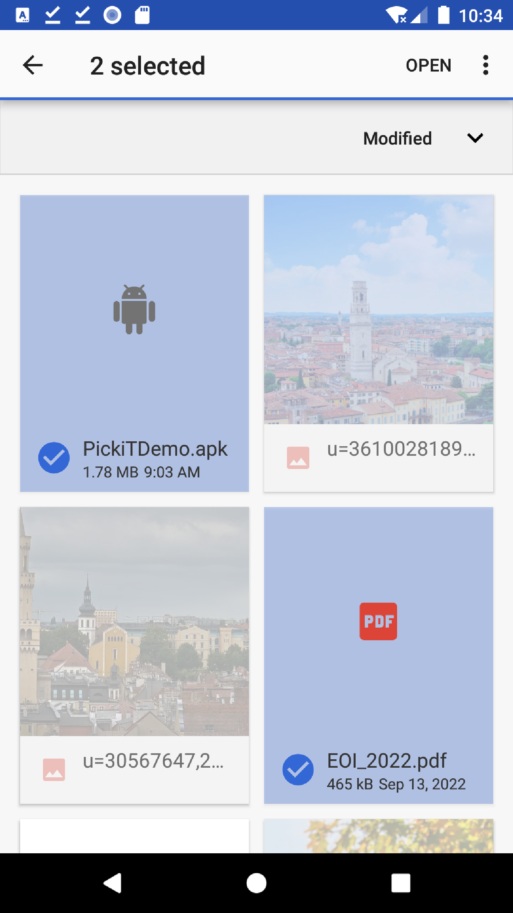

Issues & Handling
=================

Invalid hook call
-----------------

To solve the "Invalid hook call" error and helping example tests, Anclient/js now
break into 2 module, @anclient/semantier & @anclient/anreact.
( :ref:`the next section<about-invalid-hook-call>` can be a good example shows
how this issue is a big trouble)

For details on structure used to meet independent unit test and test with local
npm link.

see :ref:`@anclient/aneact tree<anreact-tree>`.

.. _about-invalid-hook-call:

React Issue #13991 - Invalid hook call
--------------------------------------

.. attention:: Since @anclient/react verified, this issue is closed.
..

.. attention:: [deprecated] Since new example of North is verified. This issue is closed.
..

.. note:: To test with test/jsample, use
    [ npm link anclient ]
..

About the error
_______________

With webpack transpiled package, both via NPM and minified js, referencing component
will reporting error.

::

    NorthApp
      |-> AnCliant package
          |-> SysComp
          |   |-> AppBar (Material UI Function)
          |   |-> WithStyles()  (of Material UI)
          |-> Sys (withStyle(SysComp))

Error report:

.. image:: ./imgs/00-react-hook-warning.png
    :height: 400px
..

Where AppBar is exported from Material UI, SysComp, extending React.Component,
from Anclient.js lib.

The React document didn't solve this problem, and redirected to issue 13991.
Webpack also have similar issue report. See
`Rreact Document <https://reactjs.org/link/error-boundaries>`_ and issues:

`Facebook issue 13991 <https://github.com/facebook/react/issues/13991>`_ and

`Webpack issue 13868 <https://github.com/webpack/webpack/issues/13868>`_

Cause of Error
______________

This error is suppressed by resolving react of NorthApp to Anclient's node_modules/react.

In example.js/north-star/webpack.config.js:

.. code-block:: javascript

	resolve: {
		alias: { react: path.resolve('../../../js/node_modules/react') }
	},

..

This can be explained as duplicated react libs been used.

Solution
________

In Anclient, react, react-dom & material-ui/core are transpiled as external by webpack, see webpack.config.js.

.. code-block:: javascript

    module.exports = {
        externals: {
            'react': 'react',
            'react-dom' : 'reactDOM',
            "@material-ui/core": "MaterialUI"
        },

        ...

    }
..

In NorthApp, react & react-dom are installed locally. Then Anclient can be imported like:

.. code-block:: javascript

    import {
        an, AnClient, SessionClient, Protocol,
        L, Langstrs,
        AnContext, AnError, AnReactExt,
        Sys, SysComp, Domain, Roles, Orgs, Users
    } from 'anclient';
..

Similar of React Issue #13991
_____________________________

A tried scenario:

1. publish test/react-app as @anclient/test-react

2. install anclient in test/react-app

3. AnContext.anReact is undefined for <QueryForm /> in <Domain />

.. code-block:: javascript

    componentDidMount() {
      if (!this.context || !this.context.anReact)
        throw new Error('AnQueryFormComp can\'t bind controls without AnContext initialized with AnReact.');
      ...
    }
..

ReferenceError: regeneratorRuntime is not defined
-------------------------------------------------

About the error
_______________

When handling D3 with Babel 8.2.2 or later, the async functions requiring
`regenerator runtime <https://babeljs.io/docs/en/babel-plugin-transform-regenerator>`_.

There are similar reports like `here <https://stackoverflow.com/questions/53558916/babel-7-referenceerror-regeneratorruntime-is-not-defined>`_.

Solution
________

Follow `the answer <https://stackoverflow.com/a/54490329>`_.

install core-js & regenerator-runtime

.. code-block:: bash

    npm install --save core-js
    npm install --save regenerator-runtime
..

In histogram.jsx:

.. code-block:: javascript

    import "core-js/stable";
    import "regenerator-runtime/runtime";
..

These 2 steps should solve the problem.

Query Android PDF / Office Files Results Empty
----------------------------------------------

About the issue
_______________

On Android 10, API lever 29 (Q) or lower, CursorLoader#on won't get any files
because of the Scoped Storage natural.

CursorLoader:

.. code-block:: java

    public class FileLoader extends CursorLoader {

        public FileLoader(Context context) {
            super(context);
            setProjection(FILE_PROJECTION);
            if (Build.VERSION.SDK_INT >= Build.VERSION_CODES.Q)
                setUri(MediaStore.Files.getContentUri(MediaStore.VOLUME_EXTERNAL));
            else
                setUri(MediaStore.Files.getContentUri("external"));

            setSortOrder(MediaStore.Files.FileColumns.DATE_ADDED + " DESC");
        }
    }
..

Usage (with performance issue):

.. code-block:: java

    filefilter = new FileFilterx(t, directories -> {
        if (isNeedFolderList) {
            ArrayList<Directory> list = new ArrayList<>();
            Directory all = new Directory();
            all.setName(getResources().getString(R.string.vw_all));
            list.add(all);
            list.addAll(directories);
            mFolderHelper.fillData(list);
        }
        loadirs(directories); // parse files, can't find files other than medias
    });
    filefilter.filter(this, suffix);
..

Reference:

[1] `Data and file storage overview, DOCUMENTATION at developers <https://developer.android.com/training/data-storage>`_ ,

[2]  Android API Level and Cumulative Usage, `apilevels.com <https://apilevels.com>`_

[3] Grant access to a directory's contents, Access documents and other files from shared storage
    `DOCUMENTATION at developers <https://developer.android.com/training/data-storage/shared/documents-files#grant-access-directory>`_

[4] `Android Developers, Storage access with Android 11, Youtube <https://www.youtube.com/watch?v=RjyYCUW-9tY>`_

[5] `HBiSoft, PickiT <https://github.com/HBiSoft/PickiT>`_

[6] `An up-voted answers <https://stackoverflow.com/a/71260711>`_

[7] `Answer for Android 11 <https://stackoverflow.com/a/70562311>`_

Decision
________

Let users pick local files then match the results with pushed records.

Sample App: `PickiT <https://github.com/HBiSoft/PickiT>`_

..

Using `Grant access to a directory's contents <https://developer.android.com/training/data-storage/shared/documents-files#grant-access-directory>`_
and disable the function lower than API 21.

What's next
___________

Try on Android 11.

See [4], [6] & [7].

Code snipet of [6]:

.. code-block:: java

    List<String> getPdfList(
            Uri collection,         // MediaStore.Downloads.getContentUri("external")
            String[] projection,    // result list's columes index
            String selection,       // mime of pdf
            String[] selectionArgs, // mime
            String sortOrder) {

        List<String> pdfList = new ArrayList<>();

        try (Cursor cursor = getContentResolver().query(collection, projection, selection, selectionArgs, sortOrder)) {
            assert cursor != null;

            if (cursor.moveToFirst()) {
                int columnData = cursor.getColumnIndex(MediaStore.Files.FileColumns.DATA);
                do {
                    pdfList.add((cursor.getString(columnData)));
                    Log.d(TAG, "getPdf: " + cursor.getString(columnData));
                    //you can get your pdf files
                } while (cursor.moveToNext());
            }
        }
        return pdfList;
    }
..
