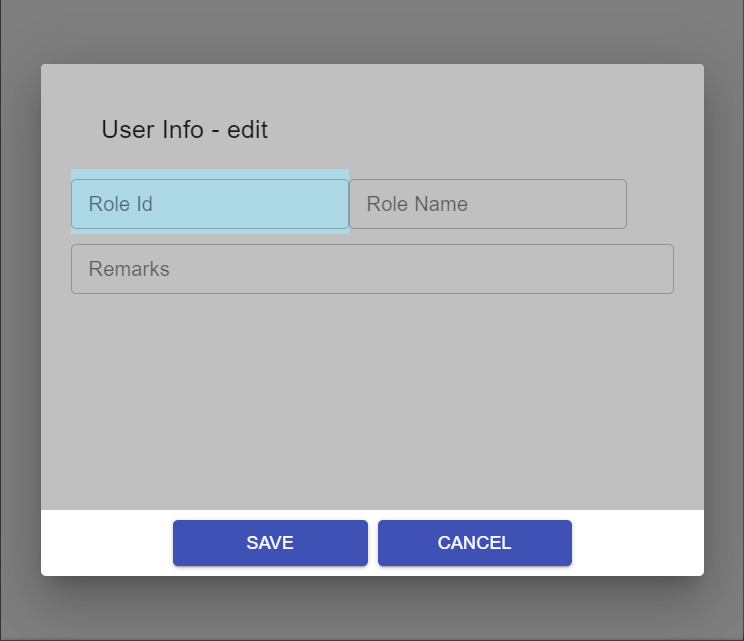

CodeSandbox
===========

1. Text controled by media size::

    roles-detials.jsx

2. Sandbox Test: `configure theme to change breakpoints <https://codesandbox.io/s/class-with-width-e5pu4?file=/index.js>`_

3. Sandbox Test: `using width <https://codesandbox.io/s/textfield-dynamic-label-979gc?file=/demo.js>`_

4. Sandbox Test: `vertical middle align example <https://codesandbox.io/s/modal-form-text-label-basics-v6okl>`_

   1. dynamic TextField label
   2. "vertical-align" can only aplied to inline or TableCell. This test solved it by using flex & alignItems. See comments in style.
   3. keep Grid children in row (flex + growdirection = row)

