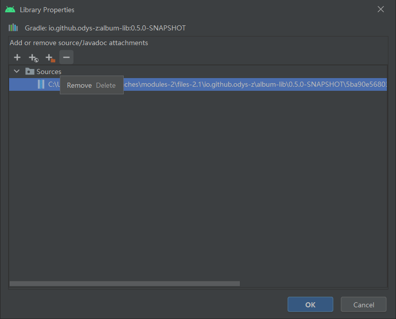

Tips
====

Tips for test/jample trouble
----------------------------

Additionally, if @anlient/semantier is installed in js/anreact/node_modules, the
testing project, jsample won't work as Protocol.sk been populated by test/jsample/app.jsx.

test/jsample will use different Protocol than @anclient/anreact.

For @anclient/anreact, it will use::

    js/anreact/node_modules/@anclient/semantier/protocol.js/Protocol

For test/jsample, it will use (via npm link)::

    js/semantier/protocol.js/Protocol

This will leads to failed on binding DatasetCombos.

**Solution**

To avoid this, link from anreact to semantier.

In js/anreact::

    npm link @anclient/semantier

.. note:: Load such things from server at runtime?
..

Login error: Invalid AES key length: 26 bytes
---------------------------------------------

If the user's password is encrypted with a different root key, failed decryption
will results in this error.

context.xml:

.. code-block: xml

    <Context reloadable="true">
      <WatchedResource>WEB-INF/web.xml</WatchedResource>
      <Parameter name="io.oz.root-key" value="16 bytes root key" orride="false"/>
    </Context>
..

Android Studio refuse to load latest Maven snapshot
---------------------------------------------------

This error will have gradle dependencies failed for updating or downloading the
latest deployed Maven snapshot version.

Solution
________

Brutally delete .gradle cache not always working. Slow down the updating or follow
`this answer <https://stackoverflow.com/a/62600906/7362888>`_.

.. _tip-docker-https:

Forward https jserv to docker container with Nginx
--------------------------------------------------

Http Jserv service working as Docker container can be accessed from Nginx https port.

Nginx.conf::

To start docker container::

Example: Semantic-jserv/jserv-sandbox.
