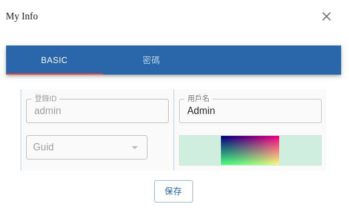

Image Upload Example (React.js)
===============================

version: since @anclient/anreact 0.9.65

Example
-------

..

source: `@anclient/anreact/MyInfCardComp <https://github.com/odys-z/Anclient/blob/master/js/anreact/src/jsample/views/my-infcard.tsx>`_

This component uses TRecordForm & formatter callback to render a image upload control.
TRecordForm is control automantically bind JSX element with data (fields property).

Usage
-----

The Image uploading control is a JSX element for view and upload image file.

The react renderer:

.. code-block:: typescript

    import { ImageUpload } from '../../react/widgets/image-upload';

    render() {
      return (
        <ImageUpload
            blankIcon={{color: "primary", width: 32, height: 32}}
            tier={tier} field={field}
            src64={rec && field && rec[field.field]}
        />);
    }
..

The MyInfTier & loadAvatar()
----------------------------

The MyInfTier is the data layer for the page including a image control.

loadAvatar() is the formatter of TRecordForm's field, which providing the JSX
element for showing image preview and handling the click event.

.. code-block:: typescript

    loadAvatar(rec: MyInfRec, field: {field: string}, opts: CompOpts) {
        let tier = this as MyInfTier;
        return (
            <ImageUpload
                blankIcon={{color: "primary", width: 32, height: 32}}
                tier={tier} field={field}
                src64={rec && field && rec[field.field]}
            />);
    }
..

CSSProperties::

    tier: the instance of MyInfTier, of which the user choosed file is stored as tier.rec[field]

    src64: base64 encoded image data

    field: field name

loadAvatar() is configured as a fieldFormatter for the field of TRecordForm.

.. code-block:: typescript

	_fields = [
		... ,
		{ field: this.imgProp, label: L('Avatar'), grid: {sm: 6, lg: 4},
		  fieldFormatter: this.loadAvatar.bind(this) }
	] as AnlistColAttrs<JSX.Element, CompOpts>[];
..

File Handling Semantics
-----------------------

The image is uploaded as a special field of request's NV value. This code handling
upload event.

.. code-block:: typescript

    saveRec(opts: { uri: string; crud: CRUD; pkval: string; }, onOk: OnCommitOk) {
        let client = this.client;
        let that = this;
        let crud = CRUD.u;

        let rec = this.rec;
        let {roleId, userName} = rec;

        let req = this.client
                    .usrAct(this.uri, CRUD.u, "save", "save my info")
                    .update(this.uri, this.mtabl,
                            {pk: this.pkval.pk, v: opts.pkval},
                            {roleId, userName});
        // about attached image:
        // delete old, insert new (image in rec[imgProp] is updated by TRecordForm/ImageUpload)
        if ( rec.attId )
            req.Body()
                .post( new DeleteReq(this.uri, "a_attaches", undefined)
                    .whereEq('busiId', rec[this.pkval.pk] as string || '')
                    .whereEq('busiTbl', this.mtabl) );
        if ( rec[this.imgProp] ) {
            req.Body().post(
                new InsertReq(this.uri, "a_attaches")
                    .nv('busiTbl', 'a_users').nv('busiId', this.pkval.v)
                    .nv('attName', rec.attName)
                    .nv('mime', rec.mime)
                    .nv('uri', dataOfurl(rec[this.imgProp] as string)) );
        }

        client.commit(req,
            (resp) => {
                let bd = resp.Body();
                if (crud === CRUD.c)
                    // NOTE:
                    // resulving auto-k is a typicall semantic processing, don't expose this to caller
                    that.pkval.v = bd.resulve(that.mtabl, that.pkval.pk, that.rec);
                onOk(resp);
            },
            this.errCtx);
        }
    }
..

This method creates a post delete and insert request, uploading the file as a
database field: a_attaches.uri, value = dataOfurl(rec[this.imgProp]).

Function dataOfurl() convert file content into base 64 string for uploading.

The image file is saved as a External File.

Semantics configuration example:

.. code-block:: xml

    <!-- external file (attachments to a_user): save as file -->
    <s>
        <id>att.02</id>
        <smtc>ef</smtc>
        <tabl>a_attaches</tabl>
        <pk>attId</pk>
        <args>$VOLUME_HOME/uploads,uri,busiTbl,busiId,attName</args>
    </s>
..
