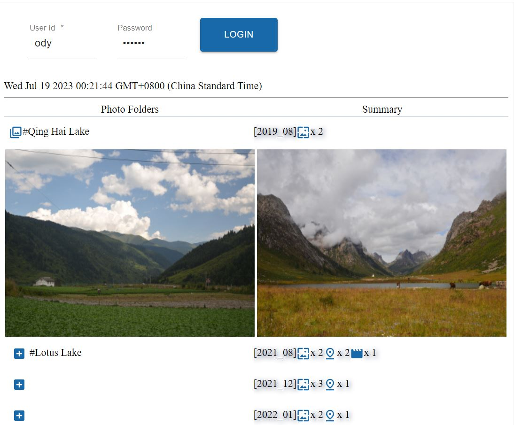
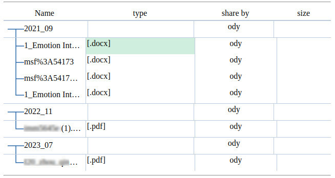

Trees
=====

In the js/anreact/test/sessionless folder,

::

    npm i
    webpack

.. _controls_treeditor:

Test AnTreeditor
----------------

Test page::

    js/anreact/test/sessionless/dist/widgets.html

This front page work with `jserv-sandbox <https://github.com/odys-z/semantic-jserv/tree/master/jserv-sandbox>`_.
For @anclient/anreact v0.4.36, a docker image, `jsandbox:treeditor <https://hub.docker.com/r/odysz/jsandbox/tags>`_,
for testing AnTreeditor is published.

To install Docker, start the container with scripts::

    ./docker-start

This will pull a docker image, odysz/jsandbox:treeditor, into local container.

Start VS Code, load dist/widgets.html with Anprism. Follwing is what is expected:

To deploy docker container behind a Nginx proxy for https protocol,
see :ref:`Tip: deploy docker as Nginx backend server working as a https domain<tip-docker-https>`

Customize Tree Grid
-------------------

See `Anclient/examples/example.js/album/app.tsx <https://github.com/odys-z/Anclient/blob/master/examples/example.js/album/src/app.tsx>`_,
function rander().typeParser().

To Customize cells in AnTreegrid (also AnTreeditor), feed the control with a formatter,

.. code-block:: html

    <AnTreegrid
        pk={''} onSelectChange={()=>{}}
        tier={this.albumtier}
        columns={[
          { type: 'iconame', field: 'pname', label: L('Name'),
            grid: {sm: 6, md: 5} },
          { type: 'text', field: 'mime', label: L('type'),
            colFormatter: typeParser, // Customize a cell
            grid: {xs: 1} },
          { type: 'text', field: 'shareby', label: L('share by'),
            grid: {xs: false, sm: 3, md: 2} },
          { type: 'text', field: 'img', label: L('size'), colFormatter: folderSum,
            grid: {xs: false, sm: 2, md: 2}, thFormatter: this.switchDocMedias }
        ]}
    />
..

.. _controls_typeparser:

.. code-block:: typescript

    /**
     * In @anclient/anreact/src/react/anreact.tsx:
     * export interface ClassNames {[c: string]: string};
     * export interface Media { isLg?: boolean; isMd?: boolean; isSm?: boolean; isXs?: boolean; isXl?: boolean; };
     *
     * Generate an JSX.Element for rendering a grid cell.
     */
    function typeParser(c: AnTreegridCol, n: AnTreeNode,
            opt: {classes: ClassNames, media: Media}) {

        if (n.node.children?.length as number > 0)
            return;
        else
            return that.docIcon.typeParser(c, n, opt);
    }
..

The typeParser() implements :ref:`API of anreact/widgets/Treegrid#colFormatter() <api_widgets_tree>`.
