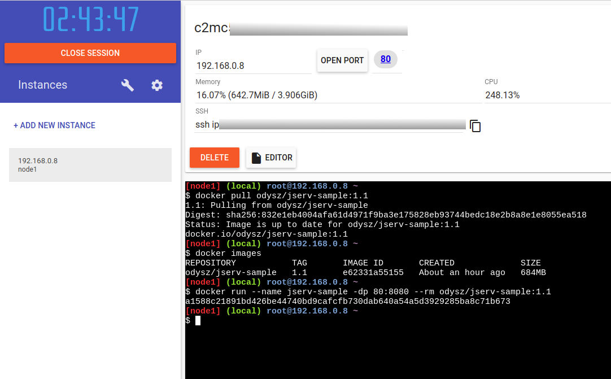
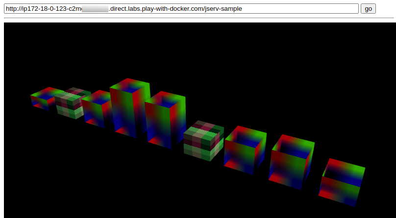

Deploy docker layers
====================

Building & Publishing
---------------------

For running Docker Nginx.

::

    docker build -t react-quiz .
    docker rm quiz
    docker run --name quiz -dp 80:80 -t react-quiz

For building *Jserv-sample* image, in semantic-jserv/jserv-sample/::

    docker pull tomcat:9.0
    docker build -t jserv-sample .
    docker run --name jserv-sample -d -p 8080:8080 --rm jserv-sample

    docker system prune -a
    docker tag e62 odysz/jserv-sample:1.1
    docker push odysz/jserv-sample:1.1

Docker Labs Quick Start
-----------------------

::

   docker pull odysz/jserv-sample:1.1
   docker run --name jserv-sample -d -p 8080:8080 --rm jserv-sample

Copy and go the url, visiting

::

    http://ip172-18-0-123-c2mc....direct.labs.play-with-docker.com/jserv-sample/menu.serv

Ending with */jserv-sample/menu.serv*.

