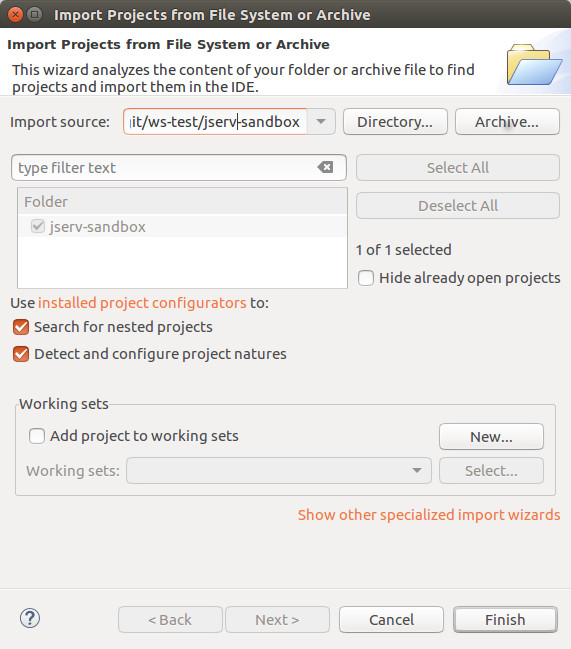
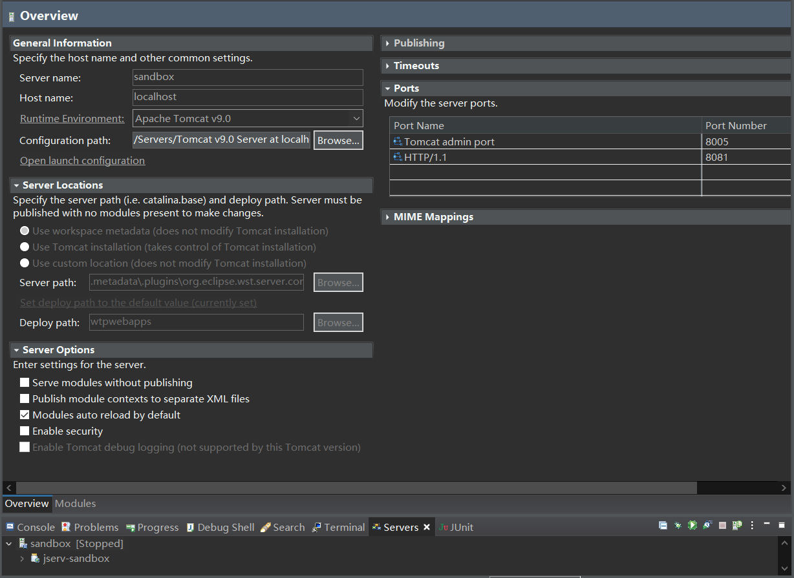
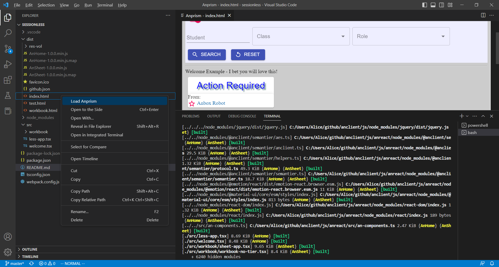
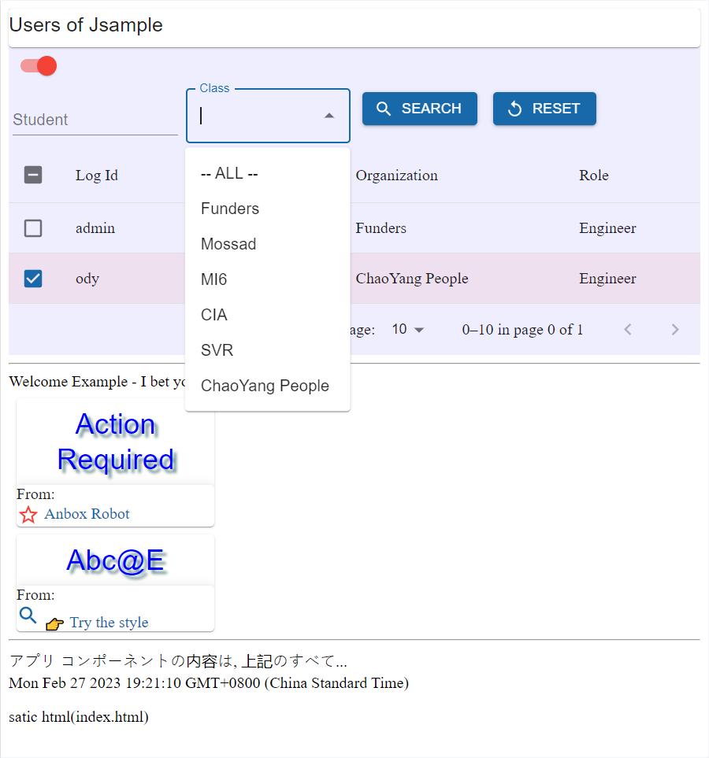

About Anclient
==============

Anclient is the client side API for semantic-jserv service like JSample, which
including:

* anclient.java,

the java client.

* @anclient/semantier,

the semantics supported protocol layer, and *Semantier* is short for Semantics Tier,
a low level js client API for accessing service provided by semantic-jserver.

Since 0.9.42, it's been ported to Typescript, with types for better user experience with
support of VS Code Intellisense.

* @anclient/anreact,

A presentation tier package for accessing semantier API, built on Material UI + ReactJS.

* anclient.cs,

the planned c# client.

Anclient.js Quick Start
=======================

There are 2 built-in typescript packages for testing that come with the installed
npm packages, which can be useful for kick start.

Start with session-managed client
---------------------------------

This sample project consists of two parts, one from the test project of semantic-jserv,
one from the test of @anclient/anreact.

1. Deploy a data service using Semantic-jserv

Say, :ref:`tsample <jsample-quick-start>`.

2. Install Anclient.js.

Anclient.js is actually implemented in Typescript.

It's two npm packages::

    npm install react react-dom
    npm install @anclient/semantier @anclient/anreact

3. Create a Typescript client

See `Anclient/js/areact/test/tsample/dist/.html <https://github.com/odys-z/Anclient/blob/master/js/test/sessionless/dist/index.html>`_
for a reactJS client, which can accessing data service, an implementation based
on semantic-jserv.

Start with the session less client
----------------------------------

This way uses jserv-sandbox (`src <https://github.com/odys-z/Anclient/tree/master/js/anreact/test/sessionless>`_)
as an example for quick start, which won't verify HTTP requests at server side.

:download: `Tutorial Sessionless Release <https://github.com/odys-z/Anclient/releases/tag/Tutorial-sessionless-quickstart>`

1. Deploy a web application of jserv-sandbox

Extract the java web project, *jserv-sandbox*, then open it as an existing maven
project,

::

    Eclipse -> File -> Open Projects from File System

then install maven package, and deploy to a Tomcat server.

To run the server, set **VOLUME_HOME** environment variable to the volume folder
path, like::

    -DVOLUME_HOME="C:\\Users\\Ody\\jserv-sandbox\\volume"

And don't forget to allow CROS if planning to deploy the servicer side at a different
domain to the web page server, where the html pages are loaded from.

In web application's configuration, e.g. tomcat server's web.xml, add

.. code-block:: xml

    <filter>
	  <filter-name>CorsFilter</filter-name>
	  <filter-class>org.apache.catalina.filters.CorsFilter</filter-class>
    </filter>

    <filter-mapping>
      <filter-name>CorsFilter</filter-name>
      <url-pattern>/*</url-pattern>
    </filter-mapping>
..

2. Install Anclient.js.

Extract *anclient.sessionless.zip* to local folder, e.g. *anclient.sessionless*.

::

    cd anclient.sessionless
    npm install
    cd test/sessionless && npm install
    webpack
    cd dist && python3 -m http.server 8888

Now let's edit sessionless/dist/github.json to point jserv to the corrrect address.
Then load the page from at::

    http://localhost:8888

The App with a HTML page's source can be found at
`Anclient/js/anreact/test/sessionless/dist/index.html <https://github.com/odys-z/Anclient/blob/master/js/anreact/test/sessionless/dist/index.html>`_.

.. code-block:: html

    

    <noscript>You need to enable JavaScript to run this app.</noscript>
    
    
..

where the function *bindHtml(div, {jsonUrl, serv})* is implemented in
`less-app.tsx <https://github.com/odys-z/Anclient/blob/master/js/anreact/test/sessionless/src/less-app.tsx>`_.

The *jsonUrl* is a configure variable that can tell *bindHtml()* where to find
json data service, the *jserv-sandbox*.

The final result load with `Anprism <https://marketplace.visualstudio.com/items?itemName=ody-zhou.anprism>`_
should like this:

