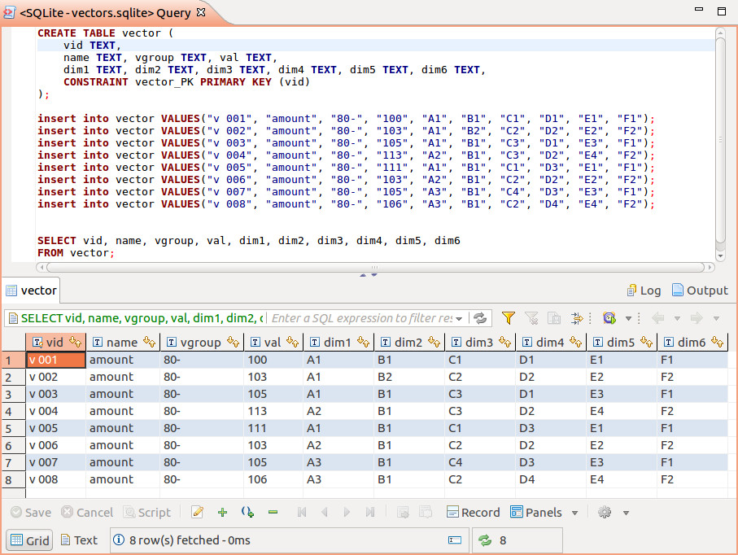

Example: xvisual
================

Copy the released template project form the `release section <https://github.com/odys-z/Anclient/releases/>`_.

Anclient has multiple samples (in the future) sharing node's modules. You can also
install those like this ::

    -+- examples.js
     |--- xvisual
     |--- sampel-TODO

To install dependencies::

    cd examples.js
    npm install --save-dev

If everything is OK, following dependencies should be installed::

    babel-plugin-syntax-jsx babel-preset-env
    jquery
    d3 earcut oboe
    anclient
    x-visual@0.3.81

**Note:** This example depends on x-visual webgl1 branch, version 0.3.81.

Install webpack for the sample project::

    cd xvisual
    npm init
    npm install webpack webpack-cli --save-dev

Then use webpack transpile the source::

    npm run build

or::

    webpack

There are many ways to host the index.html page, e.g. start a python server in
examples.js (url of index.html takes as a 2 level parent path)::

    python3 -m http.server 8080

Then browse to::

    http://localhost:8080/xvisual/bar-chart/

This example also will visiting the jserv-sample data service.
See :ref:`JSample quick start <jsample-quick-start>` for how to setup it.

Comming with the jserv-sample project is a sqlit3 db file configured as
connection id = "raw-vec". The database has a table named vector, with some data:

The example/xvisual/app.js created the Anclient querying data from jseer-sample:

.. code-block:: javascript

    let req = this.ssClient.query("raw-vec", "vector", "v", {page: 0, size: 20});
    req.body[0]
        .expr("vid").expr("val", "amount")
        .expr("dim1", "person").expr("dim2", "year").expr("dim3", "age")
        .expr("dim4").expr("dim5").expr("dim6")
        .whereCond("=", "vgroup", "'80-'");

    this.an.post(req, function() {
        bar.create(vectors);
    });
..

The examples/xvisual/bars.js will creating cubes with size of vector values. The
geometry parameters of bars are bound with vector data:

.. code-block:: javascript

    function create(vectors) {
        for (let i = 0; i < vectors.length; i++) {
            let v = vectors[i];
            let y = (v.amount - 95) * 2;
            let h = y / 2;
            this.ecs.createEntity({
                id: v.vid,
                Obj3: { geom: xv.XComponent.Obj3Type.BOX,
                        box: [20, y, 20],
                        transform: [ {translate: [i * 30 - 90, h, 0]} ]
                    },
                Visual: {vtype: xv.AssetType.mesh,
                         asset: v.person === 'A2' ?
                                 undefined : '../../assets/tex/rgb2x2.png'
                     }
            });
        }
        return this;
    }
..

The final result should like this (of which two of the bars using a default
texture generated by x-visual):

.. image:: ../imgs/02-vectors-bars.jpg
