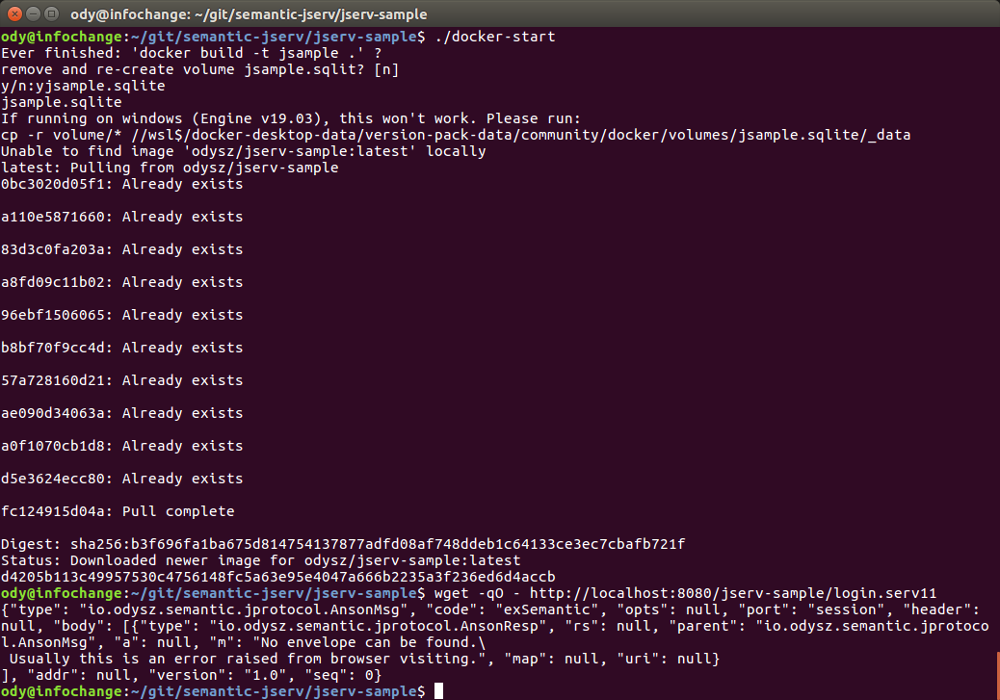

.. TODO LIST
.. 1. ADD guide for how to start application's jserv from jsample 

About jserv-sample
==================

The TSample is an example project showing how to use the semantic-jserv API to
access data service, the semantic-jserv.

Before flowing steps in the Anclient's quick start tutorial, you need to setup the
sever. The 2 parts must work together though they can be deployed separately.

TSample is the semantic-\* server side sample project, implemented ports like::

    menu (menu.serv)
    tools
    ...

Check `javadoc: Samport <https://odys-z.github.io/javadoc/jserv.sample/io/odysz/jsample/protocol/Samport.html>`_
for what TSample can do.

.. _jsample-quick-start:

Jserv-sample Quick Start
========================

Start with binary release
-------------------------

1. download the `jserv-sample v1.2 <https://github.com/odys-z/semantic-jserv/releases/tag/v1.2>`_
from release section.

The zip file is a working sample project source for quick start. Unzip it to the
local file system.

1. import eclipse project

In Eclipse::

    File -> Import ... -> Existing Projects into Workspace

Navigate to where the package is extracted.

3. create a servlet server with a 16 bytes string

Here is a sample contex.xml for Tomcat.

.. code-block:: XML

    <?xml version="1.0" encoding="UTF-8"?>
    <Context>
        <WatchedResource>WEB-INF/web.xml</WatchedResource>
        <WatchedResource>WEB-INF/tomcat-web.xml</WatchedResource>
        <WatchedResource>${catalina.base}/conf/web.xml</WatchedResource>

    	<Parameter name="io.oz.root-key" value="0123456789ABCDEF" override="false"/>
    </Context>
..

4. deploy to the servlet container server

The sample project comes with a sqlite3 db file and configured basice semantics.
The project and deploy to tomcat with Eclipse, should reporting in console like:

.. image:: imgs/01-eclipse-deploy.jpg
    :width: 320px

Visite the login serv port::

    http://<server>/<path e.g. jserv-sample>/login.serv11

.. _login-serv-get:

You will get some json data like this:

.. code-block:: json

    { "type": "io.odysz.semantic.jprotocol.AnsonMsg",
      "code": "exSemantic",
      "opts": null,
      "port": "session",
      "header": null,
      "vestion": "1.0",
      "body": [ { "type": "io.odysz.semantic.jprotocol.AnsonResp",
                  "rs": null,
                  "parent": "io.odysz.semantic.jprotocol.AnsonMsg",
                  "a": null,
                  "conn": null,
                  "m": "No envelope is available.",
                  "map": null
              } ],
      "seq": 0
    }
..

The service is reporting "No envelope is available" because the request with GET
request doesn't carry correct message. That means it's running correctly. the
next step should be using a client to visit the service.

.. attention:: Jserv is heavily dependent on CROS data service. To avoid trouble,
    Configure web.xml with this to allow Cross Origin accessing:

.. code-block:: xml

    <filter>
      <filter-name>CorsFilter</filter-name>
      <filter-class>org.apache.catalina.filters.CorsFilter</filter-class>
      <init-param>
        <param-name>cors.allowed.origins</param-name>
        <param-value>*</param-value>
      </init-param>
    </filter>
    <filter-mapping>
      <filter-name>CorsFilter</filter-name>
      <url-pattern>/*</url-pattern>
    </filter-mapping>
..

Start from source
-----------------

1. Clone and Import Eclipse Project

You can clone and import the project from here:
`semantic-jserv repository <https://github.com/odys-z/semantic-jserv>`_.

The repository contains 2 Eclipse projects, the semantic-jserv server library and
the sample web application's sample project, jserv-sample, showing how to use the
library.

Just import the sample project located in the folder "jserv-sample".

2. Check JDBC Connections

TSample using a sqlite3 db file as the default datasource for test. The provided
project has some ready to run configurations.

For the first time beginner, there is nothing to do here. More datasource configuration
based on JDBC (both connection pool and driver manager mode) can be found in
semantic-DA documents.

It's recommended have a look at the JDBC connection file, located in::

    src/main/webapp/WEB-INF/connects.xml

3. Update Maven Dependencies

Right click the imported project, then "Maven -> Update Project...".

Wait until for the project is refreshed. Now the project should be ready to be
deployed.

4. Deploy the Web Application

In this step, you need to check the url path, which will be used to configure
the client. The tomcat server.xml in Eclipse's server configuration section may
look like this:

.. code-block:: XML

    <Server>
      <Service>
        <Engine>
          ...
          <Host appBase="webapps" autoDeploy="true" name="localhost" unpackWARs="true">
             <Context docBase="jserv-sample" path="/jsample" reloadable="true"
                      source="org.eclipse.jst.jee.server:jserv-sample"/>
          </Host>
        </Engine>
      </Service>
    </Server>
..

If everything goes ok, the console should showing message like this::

    JSingleton initializing...
    INFO - JDBC initialized using inet (mysql) as default connection.
    config file : .../.metadata/.plugins/org.eclipse.wst.server.core/tmp1/wtpwebapps/jserv-sample/WEB-INF/config.xml
    Loading Semantics:
    	.../.metadata/.plugins/org.eclipse.wst.server.core/tmp1/wtpwebapps/jserv-sample/WEB-INF/semantics.xml
    show tables
    show columns from a_attaches
    show columns from ...

Note: while handling requests, you may find some error message in console like::

    line 1:19 mismatched input '<EOF>' expecting '.'

That's because of a warning message from `antlr4 <https://github.com/antlr/antlr4>`_
upon which semansss-\* are heavily based. Till now we find its is safe to ignore
it.

Now, using a browser visiting e.g.::

    http://localhost:8080/jserv-sample/login.serv11

and should get some error messages like above.

That's all! The jserv-sample service is running now. Next you should visit the
service using one of the different versions of Anclient. See the
:ref:`js client sample quick start <jsample-quick-start>` and the java client (TODO doc).

Test with Docker
----------------

.. warning:: Only tested on Ubuntu.

Since jserv-sample v1.3.2, a scripts for starting docker image is provided
`here <https://github.com/odys-z/semantic-jserv/releases/tag/v1.2>`_.

Download **docker-start** & **volume.zip**. In the folder where *volume.zip*
is extracted, run *docker-start*, which will setup volume for sqlite3 DB files
and bring up docker container. You can run docker command to check the service.

::

    docker ps
    CONTAINER ID   IMAGE                COMMAND             CREATED          STATUS          PORTS                                       NAMES
    d4205b113c49   odysz/jserv-sample   "catalina.sh run"   15 minutes ago   Up 15 minutes   0.0.0.0:8080->8080/tcp, :::8080->8080/tcp   jsample

Then use wget to check *session* port.

::

    wget -qO - http://localhost:8080/jserv-sample/login.serv11

The result is :ref:`explained here<login-serv-get>`.

