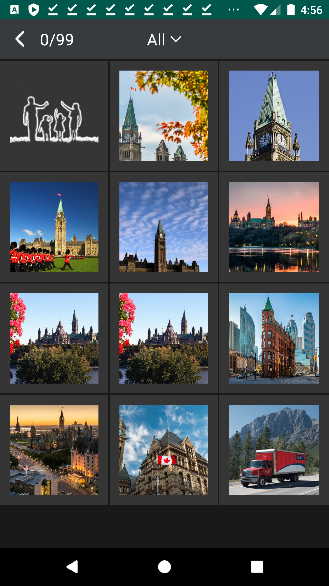

# About

This project is an Android application based on semantic-* and the extensions.

The app can running on Android accessing local files and synchronizing files with
[jserv.syncdoc](https://github.com/odys-z/semantic-jserv/tree/master/docsync.jserv).

<div>


</div>

# Credits

- The media file picker is based on [fishwjy/MultiType-FilePicker](https://github.com/fishwjy/MultiType-FilePicker)


# Troubleshootings

- 1 start Huawei Pro 30 for debug and adb device shows nothing

See [stackoverflow](https://stackoverflow.com/a/53887437/7362888).

- 2 access local Storage

See [stackoverflow](https://stackoverflow.com/a/54342155/7362888).

- 3 ajax CROS error

Try
[answer 1](https://stackoverflow.com/a/10567914/7362888)
&
[answer 2](https://stackoverflow.com/a/54342155/7362888).

- 4 AVD emulator terminated

and trying start emulator with CLI reports error:

```
    %android-sdk%/tools/emulator -avd -list-avds # for device name
    %android-sdk%/tools/emulator -avd device-name
    emulator: ERROR: Not enough space to create userdata partition. Available: ...
```

See [stackoverflow](https://stackoverflow.com/a/44931679).

To remove Android SDK system images (using a lot of disk space), uncheck the item
in SDK Manager. See [here](https://stackoverflow.com/a/34369232).

- 5 Download AVD system images failed

see [stackoverflow](https://stackoverflow.com/q/45686444)

- 6 Can not connect loack web service

```
    java.io.IOException: unexpected end of stream on http://192.168.X.X:8081/jserv-album/...
    ...
```

A similar report is [here](https://stackoverflow.com/q/72008226).
None of these [answers](https://stackoverflow.com/q/5806220) work.

Try disable Android Studio proxy setting and restart AVD device. The problem shouldn't appear again.
