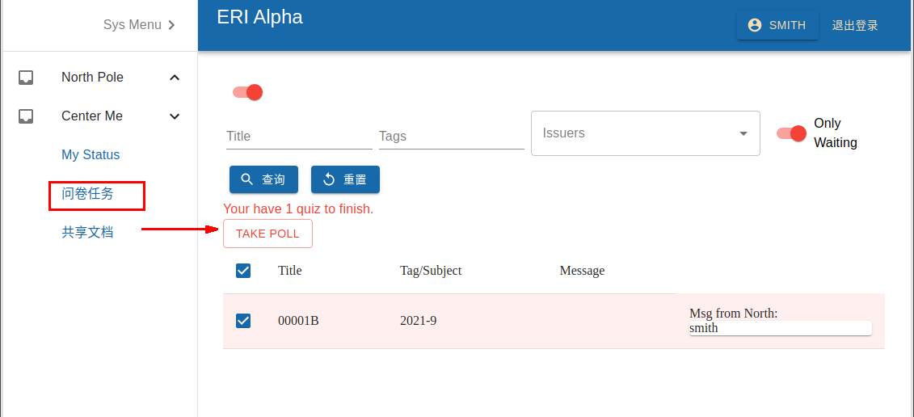
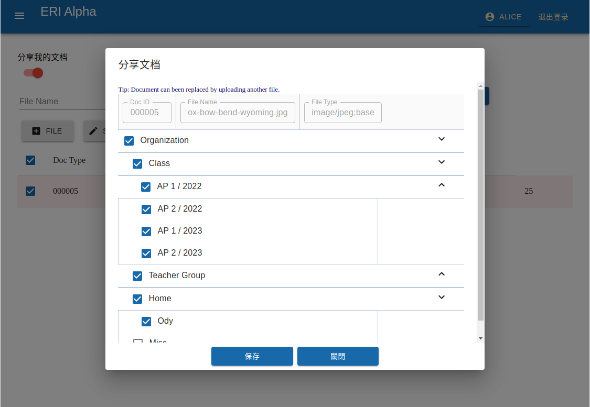

User Menu
=========

Regist & Login
--------------

ERA users must be registered by their teachers.

To login, use the registered ID as login ID.

Please change password after login and re-login after changed password.

System UI
---------

.. image:: img/01-sys.png
   :width: 420px
..

Change password
---------------

Click the user icon, and click the "password" tab.

Take the polls
--------------

.. note:: Only a student, called Dynamo in ERA can take part in a poll.
..

In Center Me / My Polls, select a quiz to start a polling event. Then go through
the questions. See below.

..

Your status can be seen by your custodians.

.. image: img/03-charts.png
   :width: 420px
..

Share Documents
---------------

You can share docs with other users via "Center Me / Sharing Docs".

A document uploaded requires set up who you want to share with.

..

You can download files in "Center Me /Shared Docs". ERA support picture and PDF preview.

.. image:: img/05-shared-preview.png
   :width: 420px
..

Now, time to take a poll!
