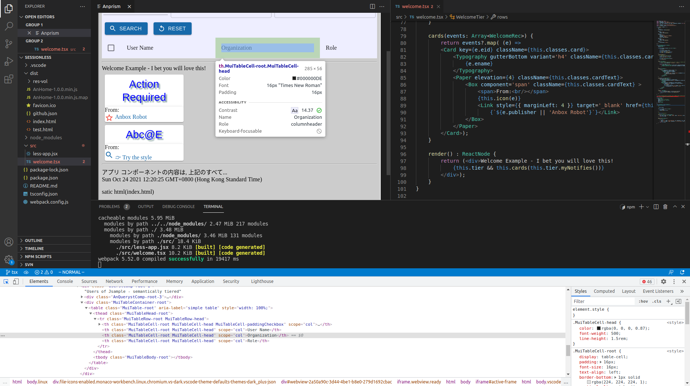

 [](https://marketplace.visualstudio.com/items?itemName=ody-zhou.anprism)


# About Anprism

Anprism is a light weight helper for editing morden (webpack transpiled) web pages in vscode.



[Screenshot (for Marketplace)](https://github.com/odys-z/Anclient/tree/master/js/anprism)

Anprism uses Python for web server, loading html page for visually editing page CSS or html.
If the page is part of webpack project, start webpack in watch mode can modify html page in 
WYSIWYG style.

## Install

In VS Code extension manager (press Ctrl + Shift + x), search 'Anprism'.

## Quic Start

If you haven't add a debug configuration, add one with VS Code. Anprism use the first
"pwa-chrome" type's webroot as it's server root. E.g, if *url* is configured in launch.json:

```
{
    "version": "0.2.0",
    "configurations": [
        {
            "name": "Attach to Chrome",
            "port": 9222,
            "request": "attach",
            "type": "pwa-chrome",
            "url": "http://localhost:8888",
            "webRoot": "${workspaceFolder}/dist"
        }
    ]
}
```

Then, in VS Code explorer, right click html page to be viewed, say "dist/index.htm", select "Load Anprism".

Or

```
    Ctr + Shift + p

    Anprism: Load Anprism
```

Anprism will not transpile or call npm scripts. You need take care of your package manually, i. e. if you are using webpack, you need start the watch task by yourself.

**Troubleshootings**

- Nothing shown in panel

The VS Code webview looks like heavily caching browsing history locally. For currrent version, please close the Anprism panel and re-load it if not worksing. Also, make sure the latest webpack output is been also loaded.

- Can't link to new html page

Experiments shows that if user's js scripts setting window.top, like this:

```
    window.top.location = "new page url";
```

will vialate the VS Code's security policy, and nothing will happen. User have to manually load new pages (right click target page, again).

- Browser cache doesn't update

Anprism's web viewer depends on VS Code's built-in Webview, which is (look like) heavily cached. This is frendly to end users but irretating to developers. Currently the author didn't find a good way to deal this (please let him know the better way). As a develper, you must know how to clear cache for your recently modified code in Chrome Dev Tool.

<p></p>

[View screenshot at repository](https://raw.githubusercontent.com/odys-z/Anclient/master/js/anprism/res/01-clear-cache.gif).

- Windows: OSError: [WinError 10013]

Anprism start a webservice on port 8888. Please check there is no other program using this, and try with firewall temperily being shut down. To shut down firewall, see [here](https://stackoverflow.com/a/58249355/7362888).

**Anprism Log**

In VS Code output window, click the dropdown options for extensions, select *Anprism*.

**Enjoy!**
